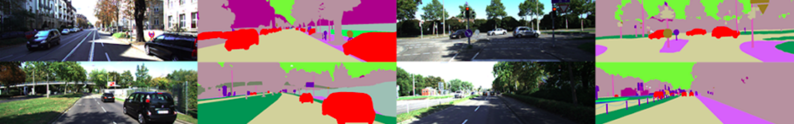

# 自动驾驶之 道路分割 使用deeplabv3模型
正在调参和训练中。。。请持续关注

作者：刘云飞

建议与合作联系邮箱：[liuyunfei.1314@163.com](mailto:liuyunfei.1314@163.com)

### 0x00 语言和工具

语言：Python 3.7

框架：PyTorch 1.2

网络结构：deeplab v3+ , 论文见paper文件夹

### 0x01 数据集

数据集采用kitti 数据集，分割所用的数据集比较费时费力，作者不再自行标注。

有精力自己标注数据集可以使用labelme标注。

Kitti datasets : http://www.cvlibs.net/datasets/kitti/

### 0x02 训练

### 0x03 结果

